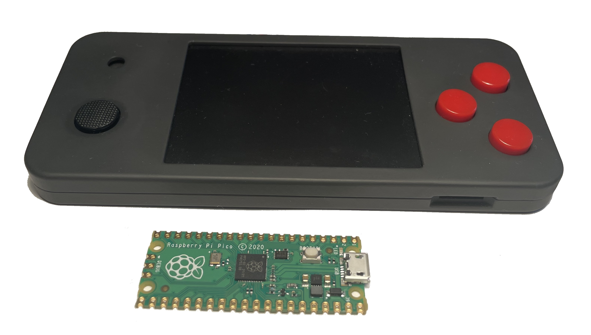
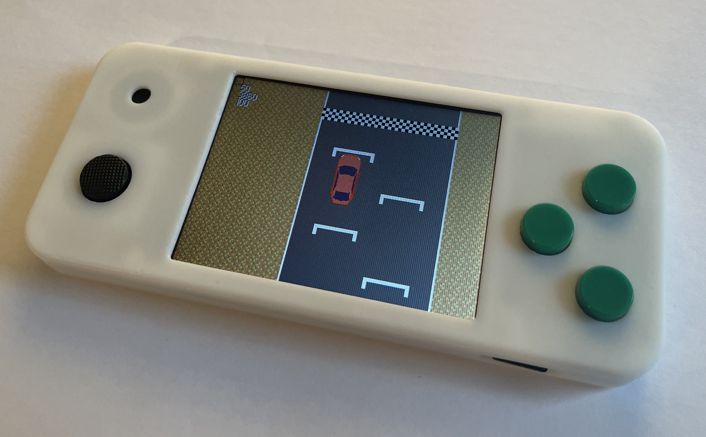
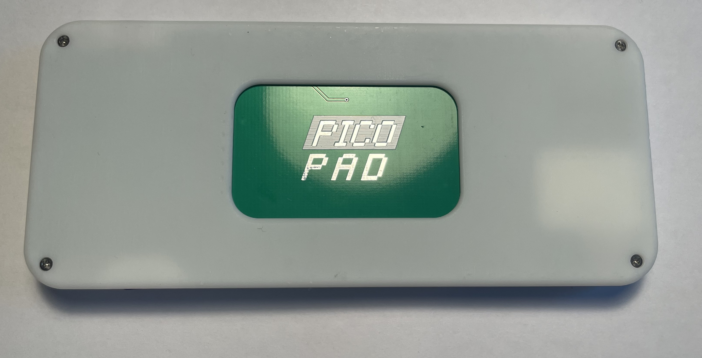
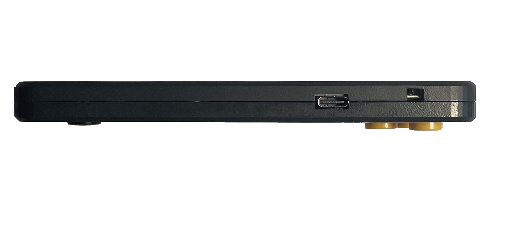
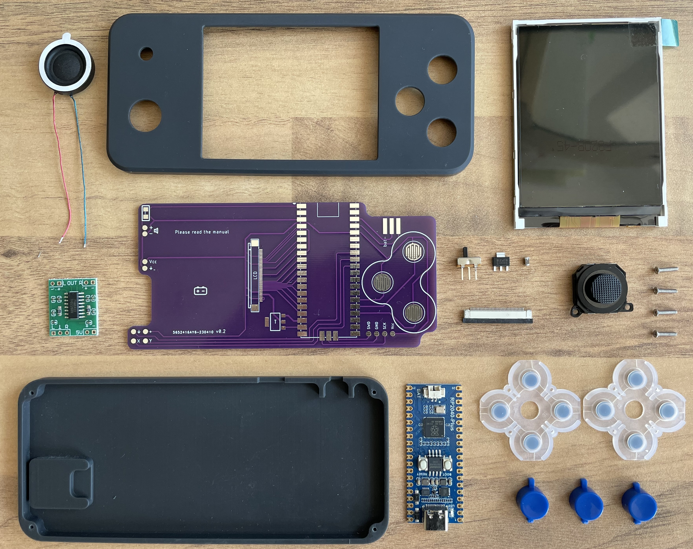
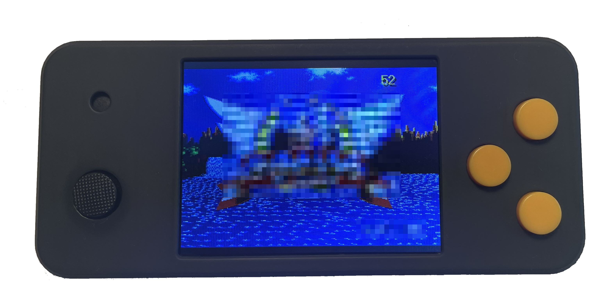

# pplib - A library for the ~~Pico Pad~~ *Pico Hero* (an open source handheld based on the Raspberry Pi Pico) for Arduino

This is the result of a private project to build a handheld gaming device based on the
*Raspberry Pi Pico*. I know there are a bunch of those out there but I wanted to design my
own for some reasons:

 - I like DIY stuff rather than just buying something off the shelf
 - a bigger screen (3.2 inches - a lot of the devices available are only 2 inches)
 - a parallel connection to the screen (for fast refresh rate)
 - a decent speaker
 - an (I hope not only for me) appealing design

And this is what it looks like:




Front view



Back view




Top view



Parts (older version without SD card)



*Pico Hero* running modified Sega Mega Drive emulator by bzhxx (https://github.com/bzhxx/gwenesis)

Watch the introduction on [Youtube](https://youtu.be/RlWg1duhfp8).

I will add more repositories, tools and details in time. Also, I am going to add Gerber files and schematics as well as STL files for printing/building the case. Consider this as preview. Please be patient, I am going at full speed.

## Specs

- 3.2 inch LCD screen with 320x240 resolution with parallel interface to the RP2040
- analog control stick, 3 buttons and on/off switch
- 3W speaker
- micro SD card slot tied via SPI (for space constraints it’s push/pull so a it’s a little fiddly to remove the SD card) 
- dimenstions: 136mm x 60mm x 12mm; weight: 100g including 600 mAh battery
- optional charging circuitry when using a RPi Pico module without charger logic.

I originally intended to call the handheld *Pico Pad* – however a Czech company was a couple days faster.

Now, the device features a simple library which does the hardware handling. The library is for *Arduino* so you just need to put it in your libraries folder and can start developing right away.

The whole library is built around Earle Philhower's Raspberry Pi Pico Arduino core (no further dependencies are involve). 

## Core features

- screen: 16 bit and 8 bit (must choose at compile time) buffers, full and half resolution panel fitter (nearest neighbor and experimental linear filter)
- fast blitter (using the RP2040's "interpolator") with zooming/rotation
- fast tilemap routines to build platformer, racing games, RPGs etc. (also using the RP2040's "interpolator")
- sound library for sound output (8 bit PCM up to 22000 Hz) with four channels for mixing
- font library with the ability to import true type fonts (FontEditor written by H. Reddmann)

## Requirements

RAM

- Display:
  - at least 19 KB RAM (e.g. 8 bit, 160x120, single FB) up to 154 KB (e.g. 16 bit, 320x240, single FB)   
  - 512 bytes of scratch-x memory when using 8 bit mode (for the palette LUT)
  - 1 state machine from PIO0 in 16 bit mode and 1 additional state machine when using 8 bit mode
  - 1 DMA channel (2 additional DMA channels when using 8 bit and custom color palette)

- Sound:
  - typically 3 KB sound buffer (depends on config)
  - 1 state machine from PIO0
  - 1 DMA channel

# Installation

The library is meant to be used with Arduino. It is written in non-object-oriented C++.
Place the *pplib* directory into your Arduino libraries folder. Next, install Earle Philhower's Raspberry Pi Pico Arduino core. 
Next step is to setup the hardware (16 bit or 8 bit color depth, resolution, panel fitter). See setup.h for details. Your sketch has then to call `ppl_init()` right at the beginning. 
That’s it. You may now build the examples. For further details see the examples.

# Setup

### Summary

Some compile time hardware setup can be done in setup.h

### Compiler switches

`LCD_PIO_SPEED`
 
This compiler switch defines the interface speed to the ILI9341 controller in MHz. The speed calculation is with respect to CPU speed. When changing CPU speed, `lcd_set_speed(freq)` has to be called again (see `lcdcom` below).
 
`LCD_ROTATION`

States the screen orientation. Possible values are:

0 = 0° (portrait)
1 = 90° (landscape)
2 = 180° (portrait upside down)
3 = 270° (landscape upside down)

`LCD_COLORDEPTH`

This determines the color depth of the LCD interface. When set to `8`  

`LCD_DOUBLE_PIXEL_LINEAR`  // works with 16 bit mode only
`LCD_DOUBLE_PIXEL_NEAREST`

# Library description

## pplib

### Summary

This is the wrapper for all other modules. Include `pplib.h` into your project to enable the use of the *Pico Hero* library.

### Functions

`int ppl_init()`

This function is called to initialize all the hardware on the *Pico Hero*. It’s supposed to be called right at the beginning of `setup()`. This also does the bootloader handling (press all three buttons when powering up the *Pico Hero* to enter bootloader mode) – so it’s very important.
On success zero is returned otherwise an error code. If the LCD initialization fails, the bootloader is called.


##lcdcom

### Summary

This is the hardware layer to interface with the LCD

### Constants

Error messages:

`LCD_SUCCESS`

No error

`LCD_NOT_INIT`

The LCD module has not been (properly) initialized.

`LCD_DMA_ERR`

Setting up the DMA failed.

`LCD_PIO_ERR`

Setting up the PIO failed.

`LCD_UNDEFINED_ERR`

Undefined error.

### Functions

`void lcd_set_speed(uint32_t freq)`
This sets the LCD interface speed to the ILI9341. Specs state a max frequency of approx. 30 MHz however 100 MHz should work fine. You should not call this in the middle of program execution (it’s called from `ppl_init()`). When the CPU is being overclocked, the function is aware of that and the PIO speed adjusted accordingly.

`int lcd_show_framebuffer(gbuffer_t buf)`

Sends a graphics buffer to the LCD.

`void lcd_wait_ready()`

Waits until a pending buffer has been sent to the LCD.

`int lcd_check_ready()`

Returns `true´ if the transmission subsystem is idle (i.e. is ready to send another buffer).

`void lcd_set_backlight(byte level)`

Sets the backlight level (from 0% to 100%)

`void lcd_enable_te()`

Enables the tearing signal.

`void lcd_disable_te()`

Disables the tearing signal.

`bool lcd_get_vblank()`

Returns the current state of the tearing signal. 


## gbuffers

### Summary

All graphics are rendered into objects called graphics buffers (gbuffer_t). Those contain the information about the image size and color depth as well as a pointer to the actual image data.
The functions are overloaded to work with 8 bit as well as 16 bit color depths.
The library does not support rendering graphics (e.g. a line or a circle) directly to the screen.

### Constants

`BUF_SUCCESS`

No error.

`BUF_ERR_NO_RAM`

Insufficient RAM.

### Types

```
typedef struct
{
    uint8_t bpp;
    uint16_t width;
	uint16_t height;
	color_t* data;
} gbuffer_t;
```

### Functions

`uint16_t  gbuf_get_width(gbuffer8_t buf)`

Returns the width of a buffer

`uint16_t  gbuf_get_height(gbuffer8_t buf)`

Returns the height of a buffer

`int gbuf_alloc(gbuffer8_t* buf, uint16_t width, uint16_t height, uint8_t colors) `

Allocates memory to an already existing graphics buffer object. Returns `BUF_ERR_NO_RAM` on failure otherwise `BUF_SUCCESS`

`uint8_t*  gbuf_get_dat_ptr(gbuffer8_t buf)`

Returns the data pointer of a buffer object.

`void gbuf_free(gbuffer8_t buf) `

Frees the data memory of a buffer object.


## blitter

### Summary

The blitter blits a source buffer to a destination buffer. The buffers may be different in dimensions but must be of the same color depth. There is only one (overloaded) function.

### Constants

`BLIT_NO_ALPHA`

Blit an image without transparency.

`BLIT_FLIP_NONE`

Blit an image without flipping.

`BLIT_FLIP_HORI`

Blit an image flipping it horizontally.

`BLIT_FLIP_VERT`

Blit an image flipping it vertically.

`BLIT_FLIP_ALL`

Blit an image flipping it both horizontally and vertically.

### Functions

```
void blit_buf(coord_t kx,     // coordinates of upper left corner
              coord_t ky,
              int32_t alpha,
              gbuffer_t src,  // pointer to source buffer
              gbuffer_t dst)  // pointer to destination buffer
```

Blits a buffer to another buffer at the position `kx`, `ky`. `alpha` states the transparent color (BLIT_NO_ALPHA for no transparency)


```
void blit_buf(coord_t kx,    // x-coord where to blit the of CENTER of the image
              coord_t ky,    // y-coord where to blit the of CENTER of the image
              float zoom,    // zoom factor (same in both directions) 
              float rot,     // rotation of the image (in rad)
              int32_t alpha, // color which is NOT being drawn (BLIT_NO_ALPHA for no transparency)
              gbuffer_t src, // pointer to source buffer
              gbuffer_t dst) // pointer to destination buffer
```

Blits a buffer to another buffer at the position `kx`, `ky`, zooms it at the factor of `zoom` and rotates is at the angle of `rot`. `alpha` states the transparent color (BLIT_NO_ALPHA for no transparency).
Note: Due to the nature of how the rotation is done with the "interpolator", when rotating the original image must be smaller in size than the buffer containing it. In fact it needs to be smaller by a factor of sqrt(2) x sqrt(1.75). This is because otherwise there will be artifacts from the "interpolator" folding back parts of the image into the visible area.
For example if the buffer dimensions are 16 by 8 pixels, the visible area must be centered and not exceed 8 by 4 pixels:

(#: allowed image area, O: blank area - background or "transparent color")

```
OOOOOOOOOOOOOOOO
OOOOOOOOOOOOOOOO
OOOO########OOOO
OOOO########OOOO
OOOO########OOOO
OOOO########OOOO
OOOOOOOOOOOOOOOO
OOOOOOOOOOOOOOOO
```

This is somewhat a tradeoff between memory usage and  performance. Images are therefore best stored in flash.
Both width and height of the image size must be power of 2. Using square dimensions is advised to prevent fold artifacts, however this consumes more storage.


```
void blit_buf(coord_t kx,     // x-coord where to blit the of CENTER of the image
              coord_t ky,     // y-coord where to blit the of CENTER of the image
              float zoom_x,   // zoom factor in x direction
              float zoom_y,   // zoom factor in y direction
              uint8_t flip,   // whether to flip the image
              int32_t alpha,  // color which is NOT being drawn (BLIT_NO_ALPHA for no transparency)
              gbuffer_t src,  // pointer to source buffer
              gbuffer_t dst)  // pointer to destination buffer
```

Blits a buffer to another buffer at the position `kx`, `ky`, zooms it in horizontal direction with the factor of `zoom_x` in vertical direction with the factor of `zoom_y`. `flip` states whether to flip the image (use `BLIT_FLIP_HORI`, `BLIT_FLIP_VERT` and `BLIT_FLIP_ALL` to determine how to flip the image). Alpha states the transparent color (`BLIT_NO_ALPHA` for no transparency).
Since this operation is accelerated by the use of the "interpolator", both width and height of the image size must be power of 2.

## colors

### Summary

The color modules helps converting color formats.

### Types:

`typedef color16_t color_t`

`typedef color8_t color_t`

### Functions

Colors may be converted, composed or channels may be extracted using the following functions:

`color16_t rgb_col_888_565(uint8_t r, uint8_t g, uint8_t b)`

Returns the color in 16 bit machine readable format when given r g and b values in 24 bits. (R-G-B 8-8-8)
Ranges - r: 0..255, g: 0..255 and b: 0..255

`color8_t rgb_col_888_332(uint8_t r, uint8_t g, uint8_t b)`

Returns the color in 8 bit in machine readable format when given r g and b values in 24 bits. (R-G-B 8-8-8)
Ranges - r: 0..255, g: 0..255 and b: 0..255
   
`color16_t rgb_col_565_565(uint8_t r, uint8_t g, uint8_t b)`

Returns the color in 16 bit machine readable format when given r g and b values in 16 bits. R-G-B 5-6-5
Ranges - r: 0..31, g: 0..63 and b: 0..31
   
`color8_t rgb_col_332_332(uint8_t r, uint8_t g, uint8_t b)`

Returns the color in 8 bit machine readable format when given r g and b values in 8 bits. (R-G-B 3-3-2)
Ranges - r: 0..7, g: 0..7 and b: 0..3

`uint8_t rgb_col_565_red(color16_t col)`

Returns the red component of a RGB565 color as a value ranging from 0..31

`uint8_t rgb_col_565_green(color16_t col)`

Returns the green component of a RGB565 color as a value ranging from 0..63

`uint8_t rgb_col_565_blue(color16_t col)`

Returns the blue component of a RGB565 color as a value ranging from 0..31

## fonts

### Summary

A small font drawing library is included. This library can do basic font drawing into graphics buffers. In order to import new fonts, please see `pplib_utils` repository.

### Types

`typedef uint8_t font_t`

### Functions

`int font_get_width(font_t* font)`

Returns the width of a font in pixels.

`int font_get_height(font_t* font)`

Returns the height of a font in pixels.

`int font_get_char_width(char c, font_t* font)`

Returns the width of a character in pixels.

`int font_get_string_width(char* str, font_t* font)`

Returns the width of a string in pixels.

`void font_put_char(coord_t pos_x, coord_t pos_y, color_t col, char c, font_t* font, gbuffer_t dst)`

Draws a single character of the font `font` to the coordinates `pos_x` and `pos_y` using the color `col` to the graphicsbuffer `dst`.

`void font_write_string(coord_t pos_x, coord_t pos_y, color_t col, char* str, font_t* font, gbuffer_t dst)`

Draws a string of characters of the font `font` to the coordinates `pos_x` and `pos_y` using the color `col` to the graphicsbuffer `dst`.

`void font_write_string_centered(coord_t pos_x, coord_t y, color_t col, char* str, font_t* font, gbuffer_t dst)`

Draws a horizintally centered string of characters of the font `font` to the coordinates `pos_x` and `pos_y` using the color `col` to the graphicsbuffer `dst`.

## tile maps

### Summary

Tiles maps are used to build environments out of tiles (in order to save storage). Tile maps consist of two components: a tile map that defines which tile has to be placed where. And the tile data containing the actual image information. If a tile is repeated multiple times, then storage memory may be saved.

Tile map objects (tile_map_t) contain an 8 bit array and that means there is a maximum number of 256 different tiles per map allowed. Every byte of the map array holds an number that represents a certain tile. A tile data object (tile_data_t) is very similar to a graphics buffer but also contains the number of tiles stored which allows multiple tiles to be contained in a single object. Tile map dimenstions need to be a power of 2 (e.g. 64 by 32).

The tiles themselves may be of 8 or 16 bit color depth. A constraint introduced by the way the "interpolator" handles the lookup is that the width and the height of a tile must be a power of 2 as does the width and the height of the map. For example a map may be 128 by 64 tiles. And each of the tiles may be of the size 64 by 32 pixels. All tiles of a tile data object are of the same size. Tile width multiplied by tile height must not exceed 65536.

### Types

```
typedef struct 
{
    uint16_t width;
	uint16_t height;
	color8_t* data;
} tile_map_t;
```

```
typedef struct 
{
    uint16_t width;
    uint16_t height;
    uint16_t num;	
	gbuffer_t* image;
} tile_data_t;
```

### Functions

```
void tile_blit_mode7(coord_t kx,           // start in fb window x
                     coord_t ky,           // start in fb window y
                     coord_t w,            // window width
                     coord_t h,            // window height
                     float px,             // translation within window
                     float py,             // translation within window
                     float pz,             // translation within window
                     float pr,             // rotation within window
                     tile_map_t map_data,  // map data
                     tile_data_t tile_set, // tile data
                     int32_t alpha,        // transparency
                     gbuffer_t buf);       // pointer to destination buffer
```

This blits a tile map in SNES-mode-7-style. A pseudo 3D affine transformation. Since the RP2040 "interpolator" does most of the work this works with a frame rate sufficient for full screen display.

`kx`, `ky`, w and h state the size of the image in the framebuffer. `px`, `py` and `pz` state the translation of the map (what part of the map you get to see) and `pr` states the rotation. See *Pico Racer* example. `alpha` defines the color which is not being drawn (BLIT_NO_ALPHA for no transparency).


```
void tile_blit_rot(coord_t kx,            // start in fb window x
                   coord_t ky,            // start in fb window y
                   coord_t w,             // window width
                   coord_t h,             // window height
                   coord_t px,            // translation within window
                   coord_t py,  
                   coord_t pivot_x,       // pivot point (in screen/buffer coords, 0/0 is upper left corner)
                   coord_t pivot_y,  
                   float rot,             // angle
                   float zoom_x,          // zoom in horizontal direction
                   float zoom_y,          // zoom in vertical direction
                   tile_map_t map_data,   // map data
                   tile_data_t tile_set,  // tile data
                   int32_t alpha,         // transparency
                   gbuffer_t buf);        // pointer to destination buffer
```

This blits a tile map in top down style. Since the RP2040's "interpolator" does most of the work this works with a frame rate sufficient for full screen display. See *Pico Racer* example.

`kx`, `ky`, `w` and `h` state the size of the image in the (frame)buffer. `px` and `py`  state the translation of the map (what part of the map you get to see) and `pivot_x` and `pivot_y` state the coordinated of the pivot point in case you want to rotate the map by the angle `rot`. `zoom_x` and `zoom_y` state the zoom factor in horizontal resp. vertical direction. `alpha` defines the color which is not being drawn (BLIT_NO_ALPHA for no transparency).  See *Pico Racer* example.


## sound

### Summary

This modules handles the playback of sounds. There are four sound channels which can be assigned buffers for playback. All currently playing buffers are mixed on the fly and sent via DMA to the PIO which then handles the PWM playback. The buffer format is a raw 8 bit PCM format. You need to specify the playback frequency using `snd_set_freq()`. All buffers play back with the same frequency and volume. The (master) volume can be set using `snd_set_vol(uint8_t vol)`. 

### Constants

`SND_NUM_BUFS`

Default: 3

Defines the maximum queue length of audio buffers (just the queue, user need to allocate storage)

`SND_BUF_SIZE 1024`

Default: 1024

Defines the length of the internal audio buffer. There will be allocated two buffers with 2 bytes per sample so the default values takes up 4k RAM. The internal audio buffer is needed for mixing the channel as well as volume control.

`SND_NUM_CHAN 4`

Default: 4

Defines the number of audio channels. Do not edit as there also have to be changes made to the PIO in order to not mess up the timing/playback frequency.

`SND_CHAN_ALL`

States that a command applies to all audio channels

`SND_CHAN_N`

States that a command applies to audio n (n = 0, 1, 2, 3)

Errors:

`SND_SUCCESS`

No error

`SND_CHAN_INVALID`

An invalid channel has been given.

`SND_NO_RAM`

Insufficient RAM.

`SND_NOT_INIT`

The sound module has not been (properly) initialized.

`SND_DMA_ERR`

Setting up the DMA failed.

`SND_PIO_ERR`

Setting up the PIO failed.

`SND_NO_FREE_BUF`

Buffer queue is full.

`SND_UNDEFINED_ERR`

Undefined error.

### Functions

`int snd_enque_buf(uint8_t *ext_buf, uint32_t buffersize, uint8_t num_snd_channel, bool blocking)`

Enques a buffer to be played. `ext_buf` is a pointer to an unsigned 8 bit array of a PCM buffer. You may state one of four channels (SND_CHAN_0 to SND_CHAN_3). If _blocking_ is set to `SND_BLOCKING` then the function will only return once the buffer is successfully enqueued (if there is no free buffer, the function will wait for a free buffer). If set to `SND_NONBLOCKING`, the function will immediately return even if the buffer was unable to be enqueued. If the buffer was successfully enqueued `SND_SUCCESS` is returned.
The buffer will be played with support of DMA and interrupts. So this is mostly fire-and-forget. Once the buffer is enqueued, it will be played without any further action needed.

`int snd_num_bufs_free(uint8_t num_snd_channel)`

Returns the number of free buffers.

`int snd_num_bufs_waiting(uint8_t num_snd_channel)`

Returns the number of buffers waiting (0 means idle)

`int snd_cancel_channel(uint8_t num_snd_channel)`

Cancels playback on given channel (`SND_CHAN_ALL` cancels all playback)

`int snd_set_freq(uint32_t freq)`

Sets the playback frequency.

`void snd_set_vol(uint8_t vol)`

Sets the volume level (from 0 to 5)
